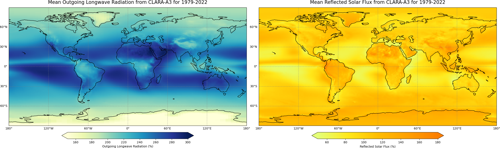
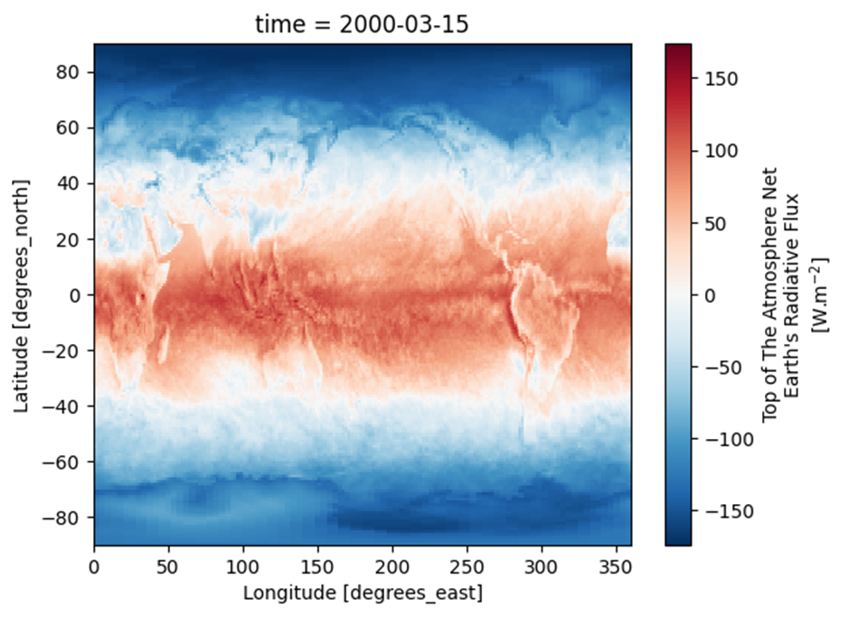
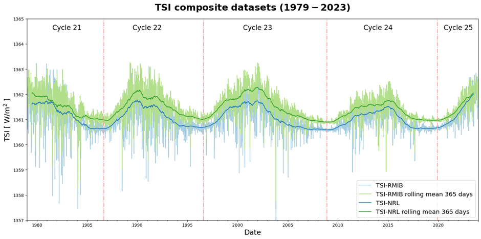
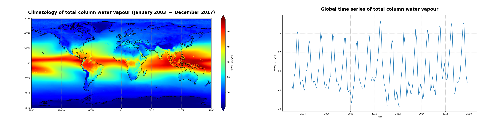
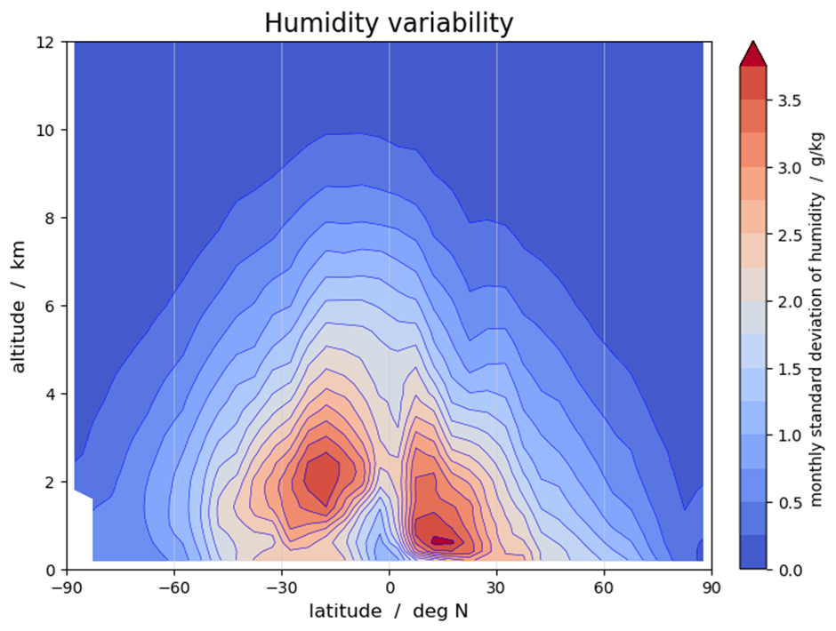
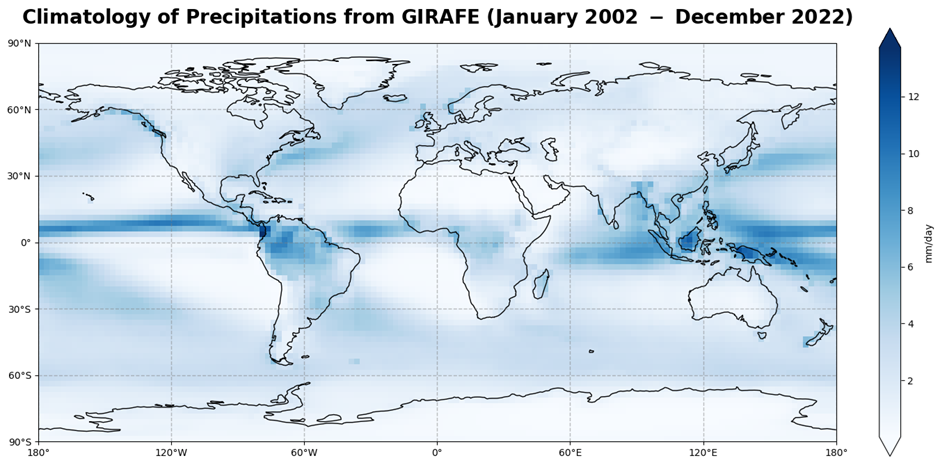

# C3S Satellite-Observations (ECV) - Atmospheric Physic

**PLEASE NOTE THAT THIS A DEVELOPMENT INSTANCE, THESE NOTE BOOKS ARE OFFICIALLY PUBLISHED ELSEWHERE**

This Jupyter book is a sub-module of the core C3S training material, it is published here for reviewing the
content prior to publication.

Satellite observations play a crucial role in monitoring various aspects of the Earth's atmosphere. This tutorial series explores the utilization of satellite data for comprehensive meteorological analyses and environmental monitoring of Atmospheric Physic parameters. 

## Earth Radiation Budget

The Earth's radiation budget is a critical component of the climate system, representing the balance between incoming solar radiation and outgoing thermal radiation. Understanding this balance is crucial for studying Earth's energy budget and climate dynamics. This tutorial series delves into various aspects of the Earth's radiation budget and related datasets.

### [Outgoing Longwave Radiation](../erb-outgoing-longwave-radiation.ipynb)

This notebook-tutorial provides a practical introduction to the HIRS dataset available on
[C3S Earth's radiation budget from 1979 to present derived from satellite observations](https://cds.climate.copernicus.eu/cdsapp#!/dataset/satellite-earth-radiation-budget?tab=overview).  
 
We give a short introduction to the ECV Earth Radiation Budget, Outgoing Longwave Radiation (OLR) and provide three use cases of the dataset: plot the time-averaged global distribution of OLR (Use Case 1), calculate global timeseries of OLR (Use Case 2) and plot the Arctic weighted mean timeseries between 1979 and 2019 (Use Case 3).
We provide step-by-step instructions on data preparation. Use cases come with extensive documentation and each line of code is explained.  
Two figures below are results of Use Case 1 and 2, and the result of a successful run of the code.

### [Analysis of the CLARA Earth Radiation Budget Product](../erb-clara-climatology.ipynb)

This notebook provides you with an introduction on EUMETSAT's CM SAF **CLARA-A3** dataset available at the [Climate Data Store](https://cds.climate.copernicus.eu/#!/home) (CDS). The dataset contains data for Essential Climate Variables (ECVs) _Earth Radiation Budget_, as well as _Cloud Properties and Surface Radiaiton Budget_, while this notebook focuses on **Earth Radiation Budget** as part of the ECV _Earth Radiation Budget_ available here: [Earth Radiation Budget from 1982 to present derived from satellite observations](https://cds.climate.copernicus.eu/cdsapp#!/dataset/satellite-earth-radiation-budget?tab=overview).

The notebook covers the full process from scratch and starts with a short introdution to the dataset and how to access the data from the Climate Data Store of the Copernicus Climate Change Service (C3S). This is followed by a step-by-step guide on how to process and visualize the data. Once you feel comfortable with the python code, you are invited to adjust or extend the code according to your interests. After a short introduction how to use a Jupyter notebook the analysis starts. 
Two figures below are results of Use Case 1 and 2, and the result of a successful run of the code.

### [Analysis of the CERES Earth Radiation Budget Product](../erb-ceres-climatology.ipynb)

This notebook-tutorial provides an introduction to the use of the
Cloud and Earth's Radiant Energy System (CERES) Energy Balanced and Filled (EBAF) Earth's Radiation Budget ([ERB](https://cds.climate.copernicus.eu/cdsapp#!/dataset/satellite-earth-radiation-budget?tab=overview)) data record
for climate studies.

### [Total Solar Irradiance](../total-solar-irradiance.ipynb)

This notebook provides a practical introduction to the
[C3S Earth's radiation budget from 1979 to present derived from satellite observations](https://cds.climate.copernicus.eu/cdsapp#!/dataset/satellite-earth-radiation-budget?tab=overview)
dataset.
We give a short introduction to the ECV Earth Radiation Budget, ECV Product Total Solar Irradiance (TSI), and present two use cases of the dataset: plot the TSI daily values and a 12-month rolling mean, and plot two TSI composite datasets side-by-sides.

## Surface Radiation Budget

The surface radiation budget is a crucial component of Earth's energy balance, representing the balance between incoming solar radiation and outgoing terrestrial radiation at the Earth's surface. This subsection delves into the analysis of surface radiation budget climatologies and anomalies, providing insights into variations in solar and terrestrial radiation fluxes over time and space.

### [Surface Radiation Budget Climatologies and Anomalies](../srb-climatology-and-anomaly.ipynb)

This notebook provides you with an introduction on EUMETSAT's CM SAF **CLARA-A3** dataset available at the [Climate Data Store](https://cds.climate.copernicus.eu/#!/home) (CDS). The dataset contains data for Essential Climate Variables (ECVs) _Surface Radiation Budget_, as well as _Cloud Properties and Earth Radiaiton Budget_, while this notebook focuses on **Surface Radiation Budget** as part of the ECV _Surface Radiation Budget_ available here: [Surface Radiation Budget from 1982 to present derived from satellite observations](https://cds.climate.copernicus.eu/cdsapp#!/dataset/satellite-surface-radiation-budget?tab=overview).

The notebook covers the full process from scratch and starts with a short introdution to the dataset and how to access the data from the Climate Data Store of the Copernicus Climate Change Service (C3S). This is followed by a step-by-step guide on how to process and visualize the data. Once you feel comfortable with the python code, you are invited to adjust or extend the code according to your interests. After a short introduction how to use a Jupyter notebook the analysis starts. 
Two figures below are results of Use Case 1 and 2, and the result of a successful run of the code.

## Atmospheric Humidity and Cloud Cover

Atmospheric humidity and cloud cover play crucial roles in regulating the Earth's energy balance and hydrological cycle. This subsection explores satellite-based measurements of atmospheric humidity, including total column water vapor and tropospheric humidity estimates derived from radio occultation data. Additionally, it examines satellite-derived cloud cover climatologies, providing insights into cloud fraction distributions and their impact on weather and climate processes.

### [Total Column Water Vapour](../total-column-water-vapour-combi.ipynb)

This notebook-tutorial provides an introduction to the use of the
combined global near-infrared (NIR) and microwave imager (MWI) total column water vapour (TCWV) data record ([COMBI](https://cds.climate.copernicus.eu/cdsapp#!/dataset/satellite-total-column-water-vapour-land-ocean?tab=overview))
for climate studies.

### [Tropospheric Humidity Estimates from Satellite-based Radio Occultation Measurements](../tropospheric-humidity-from-radio-occultation.ipynb)

In this tutorial we will work with monthly-mean tropospheric humidity data from the Climate Data Store (CDS), demonstrating how the data can be accessed, and inspecting the data to get a quick view on the physical variables available and the data structures used. We will also have a closer look at some **_use cases_** that demonstrate a few useful applications and processing steps. The use cases include some plotting that will learn you about the humidity data and how it can be visualized.

### [Cloud Fractional Cover Climatology](../cloud-cover-climatology.ipynb)

This notebook provides you with an introduction to EUMETSAT's CM SAF **CLARA-A3** dataset available at the [Climate Data Store](https://cds.climate.copernicus.eu/#!/home)(CDS). The dataset contains data for Essential Climate Variables (ECVs) _Cloud Properties_ as well as _Surface - and Earth Radiaiton Budget_, while this notebook focuses on **Cloud Fractional Cover** as part of the ECV _Cloud Properties_ available here: [Cloud properties global gridded monthly and daily data from 1982 to present derived from satellite observations](https://cds.climate.copernicus.eu/cdsapp#!/dataset/satellite-cloud-properties?tab=overview).

In addition, the tutorial is about the **Surface downwelling longwave/shortwave flux** (as part of the ECV _Surface Radiation Budget_) to demonstrate the relation between clouds and radiation. The data is also available at the CDS: [Surface radiation budget from 1982 to present derived from satellite observations](https://cds.climate.copernicus.eu/cdsapp#!/dataset/satellite-cloud-properties?tab=overview)

The tutorial covers the full process from scratch and starts with a short introdution to the dataset and how to access the data from the Climate Data Store of the Copernicus Climate Change Service (C3S). This is followed by a step-by-step guide on how to process and visualize the data. Once you feel comfortable with the python code, you are invited to adjust or extend the code according to your interests! After a short introduction how to use a Jupyter notebook the analysis starts!

## [Precipitation](../precipitation-giraffe.ipynb)

This notebook-tutorial provides an introduction to the use of the Global Interpolated RAinFall Estimation (GIRAFE) data record for climate studies.

The Precipitation (PRE) Essential Climate Variable (ECV) and the GIRAFE product are described in introduction. Then, a first use case provides an analysis of the time averaged global and seasonal climatological distributions of the Precipitation field as well as the monthly mean climatology. The second use case presents the time series and trend analysis of Precipitation. Step-by-step instructions are provided on data preparation; the use cases are extensively documented and each line of code is explained.
The three figures below show some results from the use cases and illustrate the successful run of the code.

